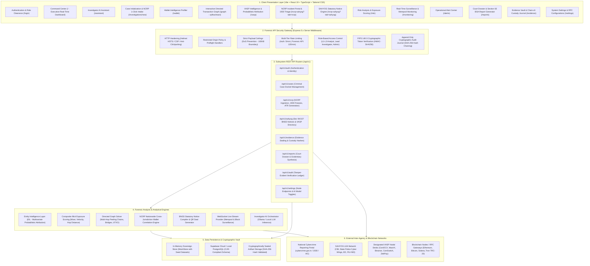

# 🛡️ CryptoTrace Intelligence

> **Next-Generation Cryptocurrency Forensic Tracing, Cybercrime Intelligence & Statutory Law Enforcement Gateway**

[](#security--statutory-compliance)
[](#statutory--legal-framework-india)
[](#ncrp--sahyog-integrations-overview)
[](#technology-stack)

---

## 📖 Table of Contents

1. [Executive Summary](#-executive-summary)
2. [The Problem It Solves](#-the-problem-it-solves)
3. [How the System Works (In Plain English)](#-how-the-system-works-in-plain-english)
4. [Core Modules Overview](#-core-modules-overview)
5. [Complete Architecture Flowchart](#-complete-architecture-flowchart)
6. [End-to-End Investigation Lifecycle (Dataflow Flowchart)](#-end-to-end-investigation-lifecycle-dataflow-flowchart)
7. [NCRP & SAHYOG Integrations (In Detail)](#-ncrp--sahyog-integrations-in-detail)
8. [Statutory & Legal Framework (BNSS & BSA 2023)](#-statutory--legal-framework-bnss--bsa-2023)
9. [Technology Stack](#-technology-stack)
10. [Quick Start & Installation Guide](#-quick-start--installation-guide)
11. [Default Credentials for Evaluation](#-default-credentials-for-evaluation)

---

## 📌 Executive Summary

**CryptoTrace Intelligence** is a specialized cyber forensic platform engineered for **Law Enforcement Agencies (LEAs)**, State Cyber Cells, Central Agencies (CBI, ED, NIA, FIU-IND), and judicial authorities.

It bridges the gap between **on-chain blockchain analytics** (tracking transactions across Bitcoin, Ethereum, Solana, and Tron) and **real-world criminal procedures**, integrating directly with India’s national cybercrime infrastructure:
* **NCRP (National Cybercrime Reporting Portal / 1930 Hotline)**: Automatically ingests citizen complaints, traces victim bank accounts through crypto mule chains, and detects cross-state syndicate wallet clusters.
* **SAHYOG Coordination Platform**: Dispatches legally binding statutory notices under the **Bharatiya Nagarik Suraksha Sanhita (BNSS), 2023** directly to registered cryptocurrency exchanges (VASPs like CoinDCX, WazirX, Binance, CoinSwitch, ZebPay) for immediate account freezes and KYC production.
* **Section 63/65B BSA Evidentiary Dossiers**: Cryptographically seals evidence with SHA-256 hash chaining to ensure 100% court admissibility under the **Bharatiya Sakshya Adhiniyam (BSA), 2023**.

---

## 🚨 The Problem It Solves

Modern cyber fraud syndicates (pig butchering, fake IPO investment dApps, Telegram task scams, ransomware) execute financial crimes at machine speed:

```
[Victim Bank Account / UPI] 
        │ (Within minutes)
        ▼
[Layer-1 Mule Bank Accounts] 
        │ (P2P Fiat Cashout)
        ▼
[Cryptocurrency Exchanges / P2P Desks] 
        │ (USDT / BTC Purchase)
        ▼
[Unhosted Suspect Wallets] ──▶ [Mixers & Bridges] ──▶ [Offshore Cash-Out / CEXs]
```

### The Challenges Faced by Police & Investigators:
1. **Jurisdictional Silos**: A victim in Delhi reports a scam, but the same suspect wallet is defrauding victims in Mumbai, Bengaluru, and Hyderabad without any central linkage.
2. **Critical 2-Hour Window**: If stolen crypto is not frozen at the destination exchange within hours, it is dispersed across decentralized mixers and lost forever.
3. **Complex Legal Paperwork**: Issuing Section 91/102 CrPC notices manually takes days of bureaucratic friction.
4. **Evidence Inadmissibility in Court**: Screenshots and raw block explorer links are routinely dismissed in court without cryptographic chain-of-custody verification.

**CryptoTrace Intelligence automates and solves all four problems in one unified system.**

---

## 💡 How the System Works (In Plain English)

| Step | What Happens | Module in Platform |
|---|---|---|
| **1. Complaint Ingestion** | A victim calls **1930** or registers a complaint on `cybercrime.gov.in`. CryptoTrace pulls the ticket with bank trail, suspect wallet addresses, and loss amounts. | **NCRP Portal** |
| **2. Cross-State Matching** | The system automatically checks if the suspect wallet has appeared in other complaints across India, exposing syndicates. | **Correlation Engine** |
| **3. One-Click Tracing** | The investigator clicks **"Trace On-Chain"**. The system maps every transaction hop across blockchains on an interactive visual canvas. | **Transaction Graph** |
| **4. Identifying Exchanges** | The platform’s attribution algorithms scan the destination wallets to reveal if they belong to known exchanges (e.g. Binance, CoinDCX). | **VASP Intelligence (EIL)** |
| **5. Rapid Freeze** | The officer triggers an immediate **1930 / CFCFRMS** emergency freeze alert to notify partner banks and exchange nodal officers. | **1930 Gateway** |
| **6. Legal Notice Dispatch** | The officer generates a **Section 94 BNSS** (KYC summons) or **Section 107 BNSS** (Asset freeze order) notice with a digital seal and sends it to the exchange. | **SAHYOG Module** |
| **7. Securing Assets** | The exchange nodal officer receives the notice, locks the suspect account, marks a lien on the crypto balance, and uploads the KYC dossier. | **VASP Response Tracker** |
| **8. Court Dossier Generation** | CryptoTrace compiles the entire trace into an official **Action Taken Report (ATR)** with a tamper-proof **Section 63 BSA certificate**. | **Report & Evidence Vault** |

---

## 🧩 Core Modules Overview

### 1. 🎛️ Command Center (`/`)
The executive operational cockpit displaying live statistics: total loss traced, active cases, monitored wallets under surveillance, and national coordination telemetry.

### 2. 🤖 Investigator AI Assistant (`/assistant`)
An onboard AI copilot powered by local/offline LLMs. It assists cyber analysts with anomaly interpretation, behavioral analysis, and automated drafting of suspicious transaction summaries.

### 3. 🆕 Case Initialization & Intake (`/investigations/new`)
Allows starting an investigation from scratch or **importing directly from an NCRP / 1930 ticket** with automatic pre-fill of Case IDs, suspect wallets, networks, and victim details.

### 4. 👛 Wallet Intelligence (`/wallet`)
In-depth forensic profiling of any Ethereum, Bitcoin, Solana, or Tron address: active balance, transaction count, counterparty clustering, risk rating, and first/last active timestamps.

### 5. 🕸️ Directed Transaction Graph (`/graph`)
An interactive graph visualization powered by `@xyflow/react`. Visually track funds hop-by-hop, identify multi-split transactions, peeling chains, mixer hops, and hot wallet sweeps.

### 6. 🏢 VASP Intelligence & Attribution (`/vasp`)
Identifies the real-world owners of blockchain addresses using multi-factor heuristics (co-spending clusters, deposit sweep timings, and behavioral proximity to known exchange hot/cold wallets).

### 7. 🛡️ NCRP Incident Portal (`/ncrp-sahyog?tab=ncrp`)
Direct management of NCRP complaints across Indian states. Filter by state or crime type, trigger 1930 emergency freeze alerts, and generate Section 63 BSA Action Taken Reports (ATR).

### 8. ⚖️ SAHYOG Statutory Notice Engine (`/ncrp-sahyog?tab=sahyog`)
Draft, sign, and dispatch legally binding statutory notices (**Section 94 & Section 107 BNSS**) to designated exchange nodal officers. Features real-time SLA countdowns (12h/24h/48h) and compliance logging.

### 9. ⚠️ Risk Analysis Engine (`/risk`)
Computes an objective **0 to 100 risk score** based on mixer exposure (Tornado Cash, Wasabi), sanctions lists (OFAC, UN), transaction velocity, and high-risk smart contracts.

### 10. 📡 Real-Time Surveillance & Monitoring (`/monitoring`)
A continuous surveillance engine that connects to live blockchain mempools and event streams. Notifies investigators the moment a flagged wallet moves funds.

### 11. 🔔 Alert Center (`/alerts`)
Triage hub for operational warnings: high-value transfers, mixer interactions, peeling chain detections, and exchange deposits.

### 12. 📁 Evidence Vault & Court Dossier (`/evidence` & `/reports`)
Append-only forensic vault where every piece of digital evidence is stamped with an immutable SHA-256 hash and chained into an audit trail conforming to **Section 63/65B of the Bharatiya Sakshya Adhiniyam, 2023**.

---

## 🏗️ Complete Architecture Flowchart



---

## 🔄 End-to-End Investigation Lifecycle (Dataflow Flowchart)

The flowchart below traces the complete lifecycle of a cyber fraud case from the citizen's initial phone call to the court conviction:

```mermaid
flowchart TD
    %% STAGE 1: INTAKE
    subgraph Stage_1["Stage 1: Incident Intake and Nationwide Correlation"]
        A1["Citizen Fraud Complaint (1930 Helpline / NCRP Portal)"] --> A2["NCRP Acknowledgment Generation (Ack No: 20241029001928)"]
        A2 --> A3["Intake Payload: Complainant Info, Bank Trail, Suspect Wallets, Defrauded INR"]
        A3 --> A4["NCRP Gateway Ingestion (/api/v1/ncrp/complaints)"]
        A4 --> A5["Cross-Jurisdiction Correlation Engine"]
        A5 --> A6{"Is Wallet Flagged in Multiple States?"}
        A6 -->|Yes| A7["Flag Organized Crime Syndicate Alert (Inter-State Repeat Target)"]
        A6 -->|No| A8["Standard Incident Classification"]
        A7 --> A9["One-Click Case Docket Creation (INV-NCRP Case)"]
        A8 --> A9
    end

    %% STAGE 2: ON-CHAIN TRACING
    subgraph Stage_2["Stage 2: On-Chain Tracing and Graph Reconstruction"]
        B1["Target Wallet and Tx Hashes Passed to Adapter Registry"]
        B1 --> B2["Direct Node Query: Ethereum / Bitcoin / Solana / Tron Gateways"]
        B2 --> B3["Extract Raw Transfers (Native Coins, Stablecoins)"]
        B3 --> B4["Directed Forensic Graph Engine (Interactive Flow Visualizer)"]
        B4 --> B5["Identify Fund Splitting, Peeling Chains, Mixers and Bridge Hops"]
    end

    %% STAGE 3: ATTRIBUTION & RISK
    subgraph Stage_3["Stage 3: Risk Evaluation and Entity Attribution"]
        C1["Multi-Vector Risk Engine (/risk)"]
        C1 --> C2["Calculate 0-100 Illicit Exposure Score (Mixer Proximity, Velocity, Sanctions)"]
        C2 --> C3["Entity Intelligence Layer (EIL Heuristics)"]
        C3 --> C4{"Is Destination Attributed to Known VASP?"}
        C4 -->|Unhosted Wallet or Mixer| C5["Apply Continuous Surveillance Rule and Add to Watchlist"]
        C4 -->|Identified Exchange Cluster| C6["Attribute to Known VASP (e.g., CoinDCX, Binance, WazirX)"]
    end

    %% STAGE 4: EMERGENCY ACTIONS & LEGAL NOTICES
    subgraph Stage_4["Stage 4: 1930 Rapid Freezes and SAHYOG Statutory Notices"]
        D1["Trigger Rapid 1930 / CFCFRMS Alert"]
        D1 --> D2["Dispatch Emergency Freeze Directives to Reporting Banks and Exchanges"]
        D3["Query Verified VASP Nodal Directory (/api/v1/sahyog/directory)"]
        D3 --> D4["Draft Statutory Legal Notice under BNSS 2023 (/api/v1/sahyog/notices)"]
        D4 --> D5{"Statutory Notice Category"}
        D5 -->|Section 94 BNSS| D6["Summons to Produce KYC Dossier, IP Logs, and Bank Links"]
        D5 -->|Section 107 BNSS| D7["Direct Asset Seizure, Account Lien-Marking and Escrow Freeze Order"]
        D6 --> D8["Generate SHA-256 Digital Verification Seal and Legal Letterhead"]
        D7 --> D8
        D8 --> D9["Dispatch Notice to Designated VASP Nodal Desk (12h-24h Statutory SLA)"]
    end

    %% STAGE 5: COMPLIANCE & COURT DOSSIER
    subgraph Stage_5["Stage 5: VASP Compliance, Evidence Sealing and Court Dossier"]
        E1["VASP Receives Notice and Executes Hard Withdrawal Block"]
        E1 --> E2["VASP Compliance Response Ingested (/api/v1/sahyog/notices/:id/status)"]
        E2 --> E3["Record Frozen Assets (USD and INR), Seizure Docket Ref, and KYC Identity"]
        E3 --> E4["Generate Section 63/65B BSA Action Taken Report (ATR)"]
        E4 --> E5["Calculate SHA-256 Certificate Hash and Cryptographic Digital Signature"]
        E5 --> E6["Append to Append-Only Forensic Audit Journal (SHA-256 Hash Chain)"]
        E6 --> E7["Export Certified Forensic Court Docket (Admissible Judicial Dossier)"]
    end

    %% INTER-STAGE DATA PIPELINE
    A9 --> B1
    B5 --> C1
    C6 --> D1
    C6 --> D3
    D9 --> E1
```



---

## 🇮🇳 NCRP & SAHYOG Integrations (In Detail)

### 1. NCRP (National Cybercrime Reporting Portal)
* **What is it?** Managed by the **Indian Cyber Crime Coordination Centre (I4C)** under the Ministry of Home Affairs (MHA), NCRP is the central intake database for all financial cyber fraud reported across India.
* **1930 Hotline & CFCFRMS**: The Citizen Financial Cyber Fraud Reporting and Management System (CFCFRMS) allows instant communication with commercial banks to place immediate liens on accounts before fraudsters withdraw cash.
* **CryptoTrace NCRP Features**:
  * Ingests complaints with 14-digit Acknowledgment Numbers (e.g. `20241029001928`).
  * Cross-correlates suspect wallet addresses nationwide. If an address reported in Delhi is also found in complaints in Bengaluru and Mumbai, a **Multi-State Repeat Target** alert is triggered.
  * Direct one-click import into a forensic investigation docket.

### 2. SAHYOG Platform
* **What is it?** An inter-agency operational coordination platform established by the MHA to enable State Cyber Cells, CBI, ED, NIA, and FIU-IND to conduct joint multi-agency task forces.
* **VASP Statutory Nodal Desks**: Direct channel to compliance officers of FIU-IND registered Virtual Asset Service Providers (VASPs).
* **CryptoTrace SAHYOG Features**:
  * **Verified VASP Directory**: Verified contact info and emergency escalation channels for CoinDCX, WazirX, Binance India Liaison, CoinSwitch, ZebPay, Mudrex, and KuCoin.
  * **Digital Notice Dispatcher**: Compiles official notices under Indian criminal law, stamps them with a unique SHA-256 seal, and tracks exchange compliance under statutory SLA timers (12h, 24h, 48h).
  * **Inter-Agency Workspaces**: Multi-agency workspaces (e.g. *Operation Chakra-III*, *Operation Garuda*) for sharing intelligence bulletins on Chinese loan app syndicates and P2P mule networks.

---

## ⚖️ Statutory & Legal Framework (BNSS & BSA 2023)

CryptoTrace Intelligence is updated to adhere to India's overhauled criminal justice legal codes:

```
┌───────────────────────────────────────┬───────────────────────────────────────┐
│ Former Code (CrPC / Evidence Act)     │ New Enacted Code (2023 - Present)     │
├───────────────────────────────────────┼───────────────────────────────────────┤
│ Section 91 CrPC (Summons to Produce)  │ Section 94 BNSS                       │
│ Section 102 CrPC (Power of Seizure)   │ Section 107 BNSS                      │
│ Section 65B Indian Evidence Act       │ Section 63 Bharatiya Sakshya Adhiniyam│
└───────────────────────────────────────┴───────────────────────────────────────┘
```

### 1. Section 94 BNSS (Production of Records)
Empowers the Investigating Officer (IO) to summon the VASP to produce:
* Off-chain KYC documentation (Aadhaar, PAN, Passport, Biometric verification).
* IP address session logs with port timestamps and ISP attribution.
* Full deposit/withdrawal ledger with linked Indian bank accounts.

### 2. Section 107 BNSS (Asset Seizure & Freezing)
Statutory directive ordering the VASP to:
* Immediately freeze the suspect user account / UID.
* Enforce a hard withdrawal block on unhosted crypto addresses.
* Mark a financial lien on USDT/BTC/ETH balances and hold funds in regulatory escrow pending court orders.

### 3. Section 63 / 65B BSA (Electronic Evidence Admissibility)
Under the **Bharatiya Sakshya Adhiniyam, 2023**, electronic records must be accompanied by a cryptographic certificate confirming:
* The cryptographic hash (SHA-256) of the forensic snapshot.
* Integrity of the system during evidence extraction (FIPS 140-3 validation).
* Unbroken chain-of-custody log verifying no tampering occurred.

---

## 🛠️ Technology Stack

```
┌─────────────────┬─────────────────────────────────────────────────────────────┐
│ Layer           │ Technology / Library                                        │
├─────────────────┼─────────────────────────────────────────────────────────────┤
│ Frontend        │ React 19, TypeScript, Vite 8, Tailwind CSS v4               │
│ Graph Visuals   │ @xyflow/react (Directed Graph Traversal & Node Rendering)   │
│ Icons & Design  │ Material Symbols Outlined, Inter & JetBrains Mono fonts     │
│ Backend Server  │ Node.js, Express 5.x, Helmet, CORS, Rate-Limiter            │
│ Security & Auth │ FIPS 140-3 HMAC-SHA256 JWT, Granular RBAC permissions        │
│ Cryptography    │ Node.js Crypto (SHA-256 Hash Chaining, HMAC Evidentiary Seal)│
│ Database        │ Supabase Cloud / Local PostgreSQL & In-Memory Sovereign Store│
│ Blockchains     │ Ethereum (EVM), Bitcoin (UTXO), Solana, Tron (TRC-20)       │
└─────────────────┴─────────────────────────────────────────────────────────────┘
```

---

## 🚀 Quick Start & Installation Guide

### Prerequisites
* **Node.js**: v20.x or higher installed.
* **Package Manager**: `npm` (v10+).

### 1. Clone & Install Dependencies
```bash
# Clone the repository
git clone https://github.com/your-org/cryptotrace.git
cd cryptotrace

# Install dependencies
npm install
```

### 2. Configure Environment Variables
Create a `.env` file in the root directory:
```env
PORT=3001
NODE_ENV=development
JWT_SECRET=CryptoTrace_GovSec_FIPS140_SecretKey_2026_LEASensitive
FIPS_MODE=true
```

### 3. Run Development Servers
You can run both the frontend Vite client and Express API gateway seamlessly:
```bash
# Launch development environment (Vite frontend with Express API plugin)
npm run dev
```
Open your browser and navigate to: `http://localhost:5173`

### 4. Build for Production
To validate TypeScript types and generate the production bundle:
```bash
npm run build
```

---

## 🔑 Default Credentials for Evaluation

The platform comes pre-seeded with law enforcement evaluation profiles:

| Role | Email | Password | Clearance Level |
|---|---|---|---|
| **Admin** | `admin@cryptotrace.gov` | `GovSec#Trace2026` | Full System & Policy Access |
| **Lead Investigator** | `sarah.connor@fbi.gov` | `GovSec#Trace2026` | Case Docket, Warrants & Evidence |
| **L3 Forensic Analyst** | `i.kerman@cryptotrace.gov` | `GovSec#Trace2026` | Graph Tracing, NCRP & SAHYOG Desk |
| **L1 Junior Analyst** | `t.reyes@cryptotrace.gov` | `GovSec#Trace2026` | Read-Only Triage Clearance |

---

## 📜 Notice & Classification

```
================================================================================
                    RESTRICTED GOVERNMENT CLASSIFICATION
               LAW ENFORCEMENT SENSITIVE // FOR OFFICIAL USE ONLY
 This software contains forensic intelligence, chain-of-custody algorithms,
 and inter-agency integration protocols designed exclusively for authorized
 judicial, law enforcement, and intelligence personnel.
================================================================================
```
