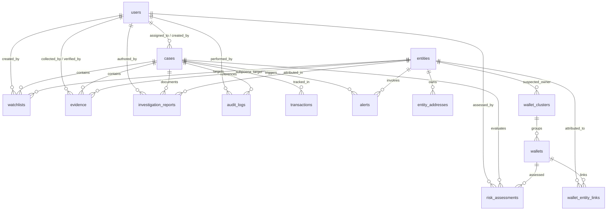

# CryptoTrace Intelligence — Database Architecture & Schema

**Classification**: LAW ENFORCEMENT SENSITIVE // OFFICIAL USE ONLY  
**Standard**: CJIS Compliant, FIPS 140-3 Cryptographic Integrity, Append-Only Forensic Logging

---

## 1. Overview of Entities

The CryptoTrace Intelligence database is designed for law enforcement blockchain forensics, fund-flow tracing, VASP entity attribution, and court-admissible evidence preservation.

| # | Entity | Description | Primary Key |
|---|---|---|---|
| 1 | `users` | Investigators, cyber forensic analysts, unit chiefs, and admins. | `id` (UUID) |
| 2 | `cases` | Official criminal investigations (e.g. ransomware, pig butchering, hack). | `id` (UUID) |
| 3 | `entities` | Identified organizations, centralized exchanges (CEX), mixers, and bridges. | `id` (UUID) |
| 4 | `wallet_clusters` | Heuristic groups of addresses linked by common-spending or sweep patterns. | `id` (UUID) |
| 5 | `wallets` | Monitored and analyzed blockchain addresses with risk scores and balances. | `id` (UUID) |
| 6 | `entity_addresses` | Known deposit pools, hot wallets, and smart contracts belonging to entities. | `id` (UUID) |
| 7 | `wallet_entity_links` | Attributions linking suspect wallets to known entities with confidence scores. | `id` (UUID) |
| 8 | `transactions` | Parsed on-chain transfers enriched with risk flags, hop counts, and USD value. | `id` (UUID) |
| 9 | `risk_assessments` | Algorithmic and ML risk evaluations (mixer exposure, velocity, sanctions). | `id` (UUID) |
| 10 | `alerts` | Real-time notifications triggered by surveillance rules and peeling chains. | `id` (UUID) |
| 11 | `watchlists` | Target addresses flagged for automated continuous on-chain surveillance. | `id` (UUID) |
| 12 | `evidence` | Cryptographically sealed artifacts with verifiable SHA-256 integrity hashes. | `id` (UUID) |
| 13 | `investigation_reports`| Official court-admissible forensic dossiers and evidentiary findings. | `id` (UUID) |
| 14 | `audit_logs` | Append-only, tamper-evident forensic activity journal with hash chaining. | `id` (UUID) |

---

## 2. Entity-Relationship Diagram



---

## 3. Important Indexes

All critical query patterns are optimized with targeted indexes:

### A. Wallet Address Indexes
- `wallets(address)` & composite `wallets(address, blockchain)`
- `entity_addresses(address)` & composite `entity_addresses(address, blockchain)`
- `wallet_entity_links(wallet_address)`
- `transactions(from_address)` & `transactions(to_address)`
- `risk_assessments(wallet_address)`
- `alerts(wallet_address)`
- `watchlists(wallet_address)`
- `cases(target_address)`
- `audit_logs(wallet_address)`

### B. Blockchain Indexes
- `wallets(blockchain)`
- `entity_addresses(blockchain)`
- `wallet_clusters(blockchain)`
- `transactions(blockchain)`
- `risk_assessments(blockchain)`
- `alerts(blockchain)`
- `watchlists(blockchain)`
- `cases(network)`

### C. Transaction Hash Indexes
- `transactions(tx_hash)` (Unique per blockchain)
- `alerts(tx_hash)`
- `audit_logs(tx_hash)`

### D. Timestamp Indexes
- `transactions(block_timestamp)` & composite `(from_address, block_timestamp DESC)`
- `cases(created_at)`
- `alerts(created_at)`
- `evidence(collected_at)`
- `investigation_reports(created_at)`
- `audit_logs(created_at)`
- `risk_assessments(assessed_at)`
- `watchlists(created_at)`
- `wallets(last_active_at)`

### E. Case ID Indexes
- `cases(case_id)` (Unique human identifier e.g. `INV-2023-0842`)
- `transactions(case_id)`
- `risk_assessments(case_id)`
- `alerts(case_id)`
- `watchlists(case_id)`
- `evidence(case_id)`
- `investigation_reports(case_id)`
- `audit_logs(case_id)`

### F. Entity ID Indexes
- `entities(entity_id)` (Unique e.g. `ENT-BINANCE-GLOBAL`)
- `entity_addresses(entity_id)`
- `wallet_clusters(suspected_entity_id)`
- `wallet_entity_links(entity_id)`
- `alerts(entity_id)`
- `watchlists(entity_id)`
- `evidence(subpoena_target_entity_id)`
- `investigation_reports(attributed_entity_id)`
- `audit_logs(entity_id)`

---

## 4. Security & Secret Protection Directive

> [!CAUTION]
> **Never expose secrets in frontend code.**
> - `password_hash` is strictly isolated on the backend server and omitted from all client-facing data transfer objects (`SafeUser`).
> - Database connection strings, JWT signing keys, and HMAC evidence secrets are loaded exclusively via server-side environment variables (`.env`).
> - The Vite frontend bundle will never include or leak database credentials.

---

## 5. Getting Started

### Initializing PostgreSQL
```bash
# Connect to PostgreSQL and create database
createdb cryptotrace_db

# Run schema DDL
psql -d cryptotrace_db -f database/schema.sql

# Seed initial forensic dataset
psql -d cryptotrace_db -f database/seed.sql
```

### Initializing SQLite (Local / In-Memory / Testing)
```bash
sqlite3 cryptotrace.db < database/sqlite_schema.sql
```
